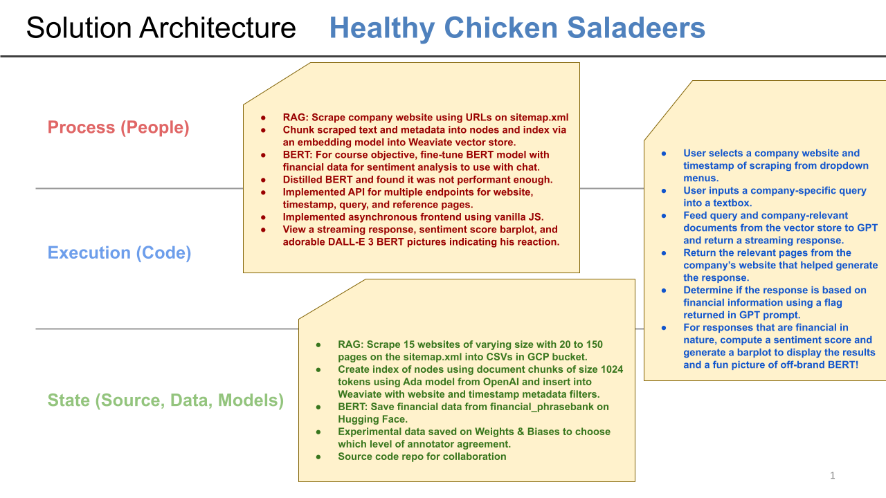
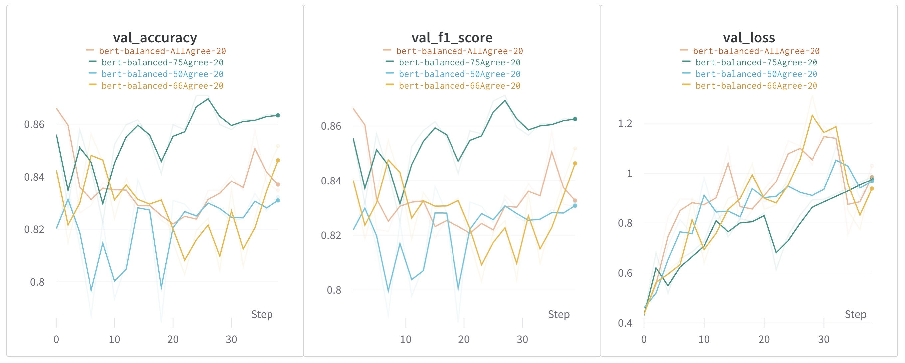

AC215 - RAG Detective
==============================

### Presentation  Video
 - \<Link Here>

### Blog Post Link

 - \<Link Here>

---

Project Organization
------------

--------
# AC215 - RAG Detective

**Team Members**
Ian Kelk, Alyssa Lutservitz, Nitesh Kumar, Mandy Wong

**Group Name**
Healthy Chicken Saladeers

**Project - Problem Definition**
Large language models like **GPT-3.5** have proven to be capable when asked about commonly known subjects or topics that they would have received a large quantity of training data for. However, when asked about topics that include data they have not been trained on, they either state that they do not possess the knowledge or, worse, can hallucinate plausible answers.

It is usually not possible to research current companies using an LLM, in order to directly compare their products and services, given that many of them are too new to have been used as training data for the LLM. We want to find a way to get up-to-date answers about companies that correspond to the information on their website.

As well, in order to fulfill milestones for this course which would not otherwise be addressed, we fine-tune a BERT model to perform financial sentiment analysis when GPT-3.5 reports that the response may be financial in nature.

## Proposed Solution

There are two main ways of addressing this limitation: **fine-tuning** and **Retrieval Augmented Generation (RAG)**.

Fine-tuning is the process of continuing to train the model using your own data, with a significantly smaller learning rate. The newly-gained knowledge is then encapsulated in the model weights themselves. The problem with fine-tuning is that it requires another copy of the model and the associated costs of hosting it, as well as the risk of "catastrophic forgetting," where the model forgets previously learned information.

RAG, however, makes use of a source of knowledge, typically a vector store of embeddings and their associated texts. By comparing the predicted embeddings of the query to the embeddings in the vector store, we can form a prompt for the LLM that fits inside its context and contains the information needed to answer the question.

Our solutions has 3 major components:

- A chatbot that uses scraped data from the website’s `sitemap.xml` file—a file intended to guide search engines to all scrapable links on the site—in a manner that’s more specific and insightful than using a search engine. The LLM should only use this context to answer the question and not insert its own training data or hallucinate an answer. This is simple to test with questions like “Who is Kim Kardashian?” which would be clearly known to the model, and ensure it replies that this answer “is not within the context provided.”
- A real-time scraper of websites on the application through asynchronous calls to the API.
- Financial sentiment analysis on relevant completions from the LLM. As part of the prompt to GPT-3.5, we ask if its response is financial in nature. If it says it is, then our fine-tuned BERT model is called on it, and gives the response as well as a plot of the probabilities and an appropriately cute non-copyright infringing Bert puppet.

# Application Design

We've put together a detailed design document outlining the application’s architecture, comprised of a Solution Architecture and Technical Architecture graphic to ensure all our components work together.

## Technical Architecture:

# RAG Component

## FastAPI Web Scraper with Cloud and Vector Store Integration

The Web Scraper API is designed using FastAPI to facilitate the extraction of website sitemap data and integrate with cloud storage and vector databases. It provides endpoints for accessing sitemaps and performing web scraping, with a consideration for handling dynamic content generated by JavaScript. The API includes safeguards for error handling and auxiliary functions to streamline browser interactions, saving data to Google Cloud, and storing data in Weaviate vector stores. It offers solutions for capturing a comprehensive range of data from various types of web pages.

The scraper's output from each webpage is a CSV file that contains the text data extracted from the webpage. It is stored in a GCP bucket as well as inserted into a vector store.

## FastAPI Vector Store Query API

This Query API features capabilities for interfacing with a Weaviate vector store to retrieve and query information. Users can obtain lists of website addresses and timestamps, and perform complex queries using methods based on the Retrieval-Augmented Generation (RAG) technique. The API is constructed to handle asynchronous data processing, providing real-time streaming responses and executing background tasks for data post-processing. It's suitable for applications that require vectorized data retrieval and analysis.

Retrieval Augmented Generation (RAG) serves as a framework to enhance Language and Learning Models (LLM) using tailored data. This approach involves two primary phases:

1. **Indexing Phase**: This is the initial stage where a knowledge base is developed and organized for future references.

2. **Querying Phase**: In this phase, pertinent information is extracted from the prepared knowledge base to aid the LLM in formulating responses to inquiries.

### Indexing Stage

In the initial indexing stage, text data must be first collected as documents and metadata. In this implementation, this is performed by the scraping of website. This data must be then split into "nodes", which is a represents a "chunk" or part of the data containing a certain portion of information. Nodes must are then indexed via an embedding model, where we plan on using OpenAI's `Ada v2` embedding model. The embeddings and metadata together create a rich representation to aid in retrieval.

### Querying Stage
In this stage, the RAG pipeline extracts the most pertinent context based on a user’s query and forwards it, along with the query, to the LLM to generate a response. This procedure equips the LLM with current knowledge that wasn’t included in its original training data. This also reduces the likelihood of hallucinations, a problem for LLMs when they invent answers for data they were insufficiently trained with. The pivotal challenges in this phase revolve around the retrieval, coordination, and analysis across one or several knowledge bases.

LlamaIndex is a data framework to ingest, structure, and access private or domain-specific data. We use it to chunk our text data and combine it with the metadata to create nodes to insert into the Weaviate vector store.

## Vertex AI Text Classification

This API provides an endpoint for text classification, interfacing with Google's Vertex AI and utilizing a fine-tuned BERT model. It accepts text input for categorization and outputs classification results along with probability scores. The service employs Google Cloud service account authentication and is intended for those needing to classify text for sentiment or thematic content. The results from the Vertex AI model are formatted into a structured JSON response for the client.

# BERT Component

## Fine-tuning BERT with Financial Data for Sentiment Analysis

The use of the `financial_phrasebank` dataset has been important for sentiment analysis in the financial domain, especially given the scarcity of annotated financial data. The dataset encompasses 4846 sentences from English financial news annotated into three sentiment classes—Neutral, Positive, and Negative—based on annotator consensus levels ranging from 50% to unanimity.

A notable trend was observed where the BERT model's performance improved with the degree of consensus among annotators. This highlighted a potential bias; sentences agreed upon by more annotators tend to have clearer sentiment, thus are easier to classify, skewing the model’s perceived accuracy.

### Debiasing Data for Fair Evaluation

In recent developments, we addressed potential biases affecting the BERT classifier's performance, originally fine-tuned on the `financial_phrasebank`. The dataset categorizes financial news sentences into three sentiments with varying consensus levels: 50%, 66%, 75%, and 100% among annotators.

An initial evaluation indicated that models trained on high-consensus data were biased towards easily recognizable sentiments, potentially reducing their real-world efficacy. Recognizing this, the dataset was debiased to balance sentiment distribution across consensus levels. Here is the plot displaying the previous biased results:

The debiasing involved ensuring random distribution of data points, creating a diversified validation/testing subset from the `sentences_50agree` dataset, and proportionally allocating sentiments for validation and testing to prevent data leakage. The resulting balanced dataset distribution was meticulously confirmed.

Subsequent evaluations with the debiased dataset revealed different performance trends, with models trained on the `66%` annotator consensus initially exhibiting the highest F1 score, while those trained on the `75%` consensus ultimately demonstrated superior performance over 20 epochs.

This procedure underscored the significance of accounting for annotator biases in machine learning model development, particularly for sentiment analysis that involves subjective judgments.

# FastAPI Service Summary

This section hosts a Dockerized FastAPI service designed for deployment on Google Cloud. It features a range of files facilitating Docker containerization and FastAPI application management.

## Key Components

### Docker Setup
- `Dockerfile`: Creates a Docker image for the FastAPI app, based on Debian with Python 3.9.
- `docker-shell.sh`: Script to build and run the Docker container, mapping local directories and setting environment variables.
- `docker-entrypoint.sh`: Script that initiates the Uvicorn server to serve the FastAPI app.

### FastAPI Application
- `api/service.py`: The core application file defining API endpoints and their functionalities.
- `api/helper.py`: Provides support functions for the FastAPI routes.

### Documentation and Instructions
- `README.txt`: Basic instructions for Docker image and container operations, and FastAPI interaction.

## API Endpoints Overview
- `GET /`: Returns a welcome message.
- `GET /streaming`: Demonstrates streaming responses using a dummy list of websites.
- `POST /rag_query`: Handles queries with streaming response.
- `GET /websites`: Lists website addresses.
- `GET /timestamps/{website_address}`: Retrieves timestamps for a specific website.
- `GET /get_urls/{query_id}`: Fetches URLs and financial flags for a query.
- `POST /vertexai_predict`: Uses Vertex AI's Prediction API for sentiment analysis.
 `GET /sitemap`: Processes input in various forms, such as straightforward website names, fully qualified URLs, direct sitemap links, or URLs ending with a slash, to ensure effective sitemap scraping. The response encapsulates the status, number of pages found, nested sitemap flags, and pertinent messages.
- `POST /scrape_sitemap`: Initiates the scraping of sitemaps and sequentially performs procedures such as streaming, saving to Google Cloud storage, and insertion into a vector storage system. During this operation, real-time updates are streamed to the client, informing them of the progress and completion of each step.

The repository offers comprehensive guidance on setting up and running the Dockerized FastAPI service, alongside detailed documentation accessible through the FastAPI's interactive documentation feature.

For more information and detailed instructions, see [api-service-documentation.md.](./docs/api-service-documentation.md)
