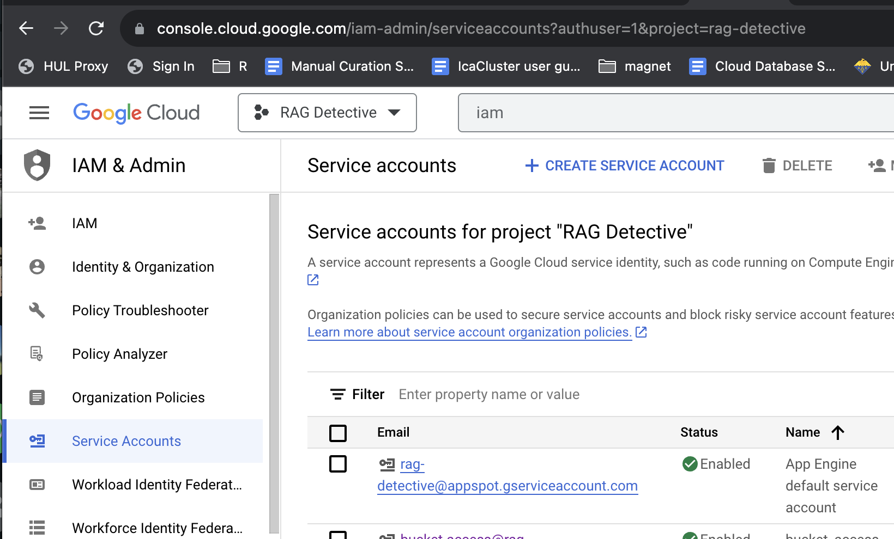
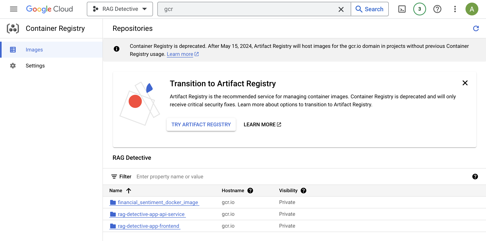
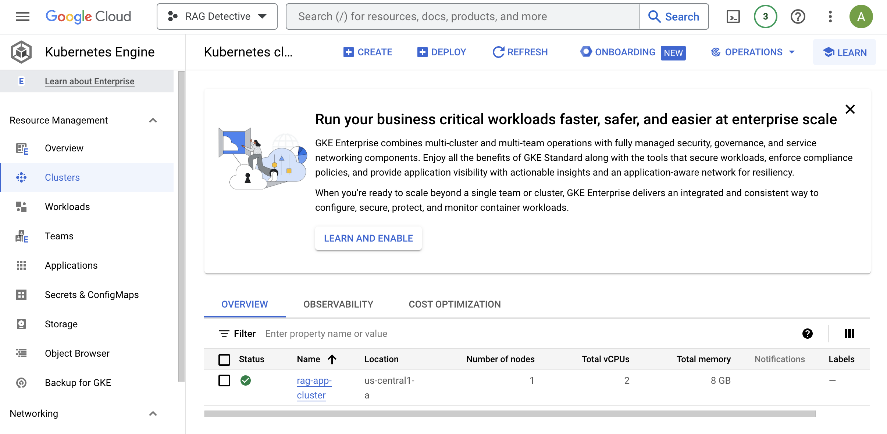

# RAG Detective App - Deployment & Scaling

- [Deployment using Ansible](#deployment-using-ansible)
- [Scaling with Kubernetes](#scaling-with-kubernetes)

## Deployment using Ansible

In this section, we explore the deployment process of the RAG Detective App using Ansible, a powerful open-source automation tool that enables a streamlined and reproducible deployment process. Ansible simplifies the deployment workflow by allowing users to define infrastructure as code and automate configuration management.

### Enable GCP APIs

Before deploying, enable the required APIs in GCP. Use the GCP search bar to find each API and enable them:
  * Compute Engine API
  * Service Usage API
  * Cloud Resource Manager API
  * Google Container Registry API
  * Kubernetes Engine API

### Setup GCP Service Accounts

1. On the GCP Console, go to: "IAM & Admins" > "Service accounts" from the top-left menu.



2.  Create a new service account called `deployment`.


3. Give the service account the following roles:
    - Compute Admin
    - Compute OS Login
    - Container Registry Service Agent
    - Kubernetes Engine Admin
    - Service Account User
    - Storage Admin


4. Then click "Done" to create the service account.

5. On the Service Account page, select the "Actions" column to the far right of the deployment service account row by clicking the vertical `...` and select "Manage keys".


6. Select "Add Key" and then select "JSON" to create the key. A private json key will download to your computer. Rename the file `deployment.json` and save to `secrets/`.


7. Follow the same steps to create a new service account called `gcp-service`. Give the account the role:
    - Storage Object Viewer

    Create and download a JSON key, rename it `gcp-service.json`,  and save to `secrets/`.

### Setup Deployment Docker Container

We will use Docker to build a container with all required software. The container will allow you to connect to GCP and create VMs.

1. Go to the deployment directory and run the following command to build/run the Docker container.
```
cd src/deployment/
sh docker-shell.sh
```

2. Check the version of the following tools:
```
gcloud --version
ansible --version
kubectl version --client
```

3. Check to make sure you are authenticated to GCP.
```
gcloud auth list
```
```
root@7a710e4f31f8:/app# gcloud auth list
                 Credentialed Accounts
ACTIVE  ACCOUNT
*       deployment@rag-detective.iam.gserviceaccount.com

To set the active account, run:
    $ gcloud config set account `ACCOUNT`

root@7a710e4f31f8:/app# 

```

4. Be sure to export your OPENAI_APIKEY as an environment variable within the deployment container.
```
export OPENAI_APIKEY=sk-OPENAI_APIKEY
```

5. Add `ml-worflow.json` file to `secrets/` within the `api_service` directory.


### Setup SSH

#### Configure OS login for service account:
```
gcloud compute project-info add-metadata --project rag-detective --metadata enable-oslogin=TRUE
```

#### Create SSH key for service account:
```
cd /secrets
ssh-keygen -f ssh-key-deployment
cd /app
```

#### Provide public SSH keys to instances
```
gcloud compute os-login ssh-keys add --key-file=/secrets/ssh-key-deployment.pub
```

This will add the following keys to `secrets/`:
  - ssh-key-deployment
  - ssh-key-deployment.pub

The secrets directory should now have the following files:
```
rag-detective-app/
├── ac215_healthychickensaladeers
├── persistent-folder
└── secrets
      ├── deployment.json
      ├── gcp-service.json
      ├── ssh-key-deployment
      └── ssh-key-deployment.pub
```

Make note of the usenamer in the output and add this to the `ansible_user` variable in `inventory.yml`

The username is: `sa_107615736039570311862`.


Here is the updated `inventory.yml`:
```
all:
    vars:
      ansible_user: sa_107615736039570311862
      ansible_ssh_private_key_file: "../../secrets/ssh-key-deployment"
      gcp_service_account_file: "../../secrets/deployment.json"
      gcp_service_account_email: "deployment@rag-detective.iam.gserviceaccount.com"
      gcp_auth_kind: "serviceaccount"
      gcp_scopes: "https://www.googleapis.com/auth/compute"
      gcp_project: "rag-detective"
      gcp_region: "us-central1"
      gcp_zone: "us-central1-a"
      docker_network_name: "appnetwork"
      persistent_disk_name: "rag-app-demo-disk"
      persistent_disk_size: 50
      machine_instance_name: "rag-app-demo"
      machine_type: "n2d-standard-2"
      machine_disk_size: 50

    children:
        appserver:
            hosts:
                localhost:
```

### Setup Deployment

#### Build and push Docker containers to GCR
```
ansible-playbook deploy-docker-images.yml -i inventory.yml
```

#### Create Compute Instance (VM) Server in GCP
```
ansible-playbook deploy-create-instance.yml -i inventory.yml --extra-vars cluster_state=present
```

Once the command runs successfully, get the external IP address of the compute instance from GCP Console and update the `appserver>hosts` in `inventory.yml`.

Here is the created VM with external IP address: 34.123.94.245.


Here is the updated `inventory.yml`:
```
all:
    vars:
      ansible_user: sa_107615736039570311862
      ansible_ssh_private_key_file: "../../secrets/ssh-key-deployment"
      gcp_service_account_file: "../../secrets/deployment.json"
      gcp_service_account_email: "deployment@rag-detective.iam.gserviceaccount.com"
      gcp_auth_kind: "serviceaccount"
      gcp_scopes: "https://www.googleapis.com/auth/compute"
      gcp_project: "rag-detective"
      gcp_region: "us-central1"
      gcp_zone: "us-central1-a"
      docker_network_name: "appnetwork"
      persistent_disk_name: "rag-app-demo-disk"
      persistent_disk_size: 50
      machine_instance_name: "rag-app-demo"
      machine_type: "n2d-standard-2"
      machine_disk_size: 50

    children:
        appserver:
            hosts:
                34.123.94.245:
```

#### Provision Compute Instance in GCP
```
ansible-playbook deploy-provision-instance.yml -i inventory.yml
```
This will install and setup everything required for deployment.

#### Setup Docker Containers in the Compute Instance
```
ansible-playbook deploy-setup-containers.yml -i inventory.yml
```

We can SSH into the VM from the GCP console and see status of the containers now:
```
sudo docker container ls
sudo docker container logs api-service -f
```

To cd into the container run this command: 
```
sudo docker exec -it api_service /bin/bash
```
### Configure Nginx

#### Setup Webserver on the Compute Instance
```
ansible-playbook deploy-setup-webserver.yml -i inventory.yml
```

This will create the nginx.conf file for default routes in the web server. Once the command runs go to http://34.123.94.245/ to acccess the app.

## Scaling with Kubernetes

If not already done, complete the following steps before creating and deploying the cluster
  #### Add `deploy-k8s-cluster.yml` to `deployment/`

  Make sure that you have the correct name for your api_service and frontend containers saved to the Google Cloud Registry:

  

  #### Start Deployment Docker Container
  - Navigate to the `deployment` directory.
  - Run `sh docker-shell.sh`.
  - Check tool versions: `gcloud --version`, `kubectl version`, `kubectl version --client`.
  - Ensure authentication to GCP: `gcloud auth list`.

  #### Build and Push Docker Containers to GCR
  ```
  ansible-playbook deploy-docker-images.yml -i inventory.yml
  ```

Once these steps have been performed you can then create and deploy the cluster.

### Create & Deploy Cluster
```
ansible-playbook deploy-k8s-cluster.yml -i inventory.yml --extra-vars cluster_state=present
```

You can see the `rag-app-cluster` in the Google Kubernetes Engine console:



### View the App
* Copy the `nginx_ingress_ip` from the terminal output .
* Go to `http://<YOUR INGRESS IP>.sslip.io`
* View here: http://34.69.27.180.sslip.io/

### Delete Cluster
```
ansible-playbook deploy-k8s-cluster.yml -i inventory.yml --extra-vars cluster_state=absent
```

### Kubectl commands
```
kubectl get all
kubectl get all --all-namespaces
kubectl get pods --all-namespaces
kubectl get componentstatuses
kubectl get nodes
kubectl get pods --namespace=rag-detective-app-cluster-namespace
```
