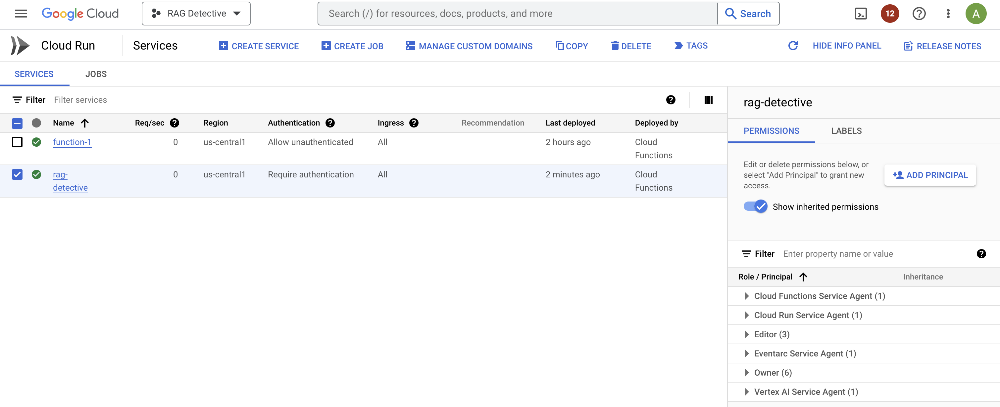
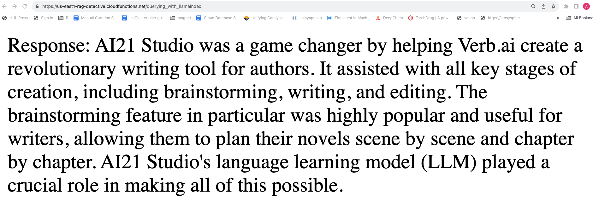

# Creating a Google Cloud Function

Google Cloud Functions are a serverless compute service that allows you to run your code without having to manage the underlying infrastructure. In this guide, we'll walk you through the steps to create a Cloud Function in Google Cloud Platform.

For our project, we have developed several cloud functions utilizing Retrieval Augmented Generation (RAG) to perform targeted queries within a domain-specific context. RAG integrates a language model's text generation capabilities with the ability to retrieve and incorporate external information, thereby improving question-answering by enabling the model to access a wider knowledge base for generating more precise and contextually relevant responses. 

- For each of these functions the weaviate docker container in our projects VM must be running!
- The `indexing` function consumes a csv file containing scraped data from a companys sitemap.xml file from our GCS bucket, converts it to a Document, and then adds its to Weaviates vector store index. To check that that the relevant information has been added to the vector store you can visit the Weaviate server url endpoint: http://34.133.13.119:8080/v1/objects and search for the companys website. The url endpoint of the function will also return a "success" message if the function runs to completion.
- The `querying` function retrieves the text embeddings for a specified companys website from Weaviate and passes that along with a query to an LLM which returns a context-based response. For an illustrative example of this function applied to our project's objectives, please refer to the end of the documentation. This function also supplies an additional prompt to the query_engine called `qa_template`, which informs the LLM to only provide responses within the provided context. This prevents the LLM from using its own training data when responding to queries.
- The function for `creating the Weaviate schema` allows us to either create a schema from scratch or to delete and recreate an existing schema. 

We have written Google Cloud Functions to conduct both the indexing and querying stages of RAG and a function to create or recreate the Weaviate schema as described in the README.md. The Python code can be found here for [indexing](./src/llama_index/gcf/index_llama_index/gcf_index_llamaindex.py), [querying](./src/llama_index/gcf/query_llama_index/gcf_query_llamaindex.py), and [creating the Weaviate schema.](./src/llama_index/gcf/create_weaviate_schema//gcf_create_weaviate_schema.py)

## Prerequisites

Before you start, you need the following:
- A Google Cloud Platform account
- A project set up in GCP

## Step 1: Create a New Cloud Function

1. Go to the [Google Cloud Console](https://console.cloud.google.com/).
2. Select your project or create a new one.
3. In the left sidebar, navigate to **Compute** > **Cloud Functions**.

## Step 2: Create a Function

1. Click the "Create Function" button.
2. If you have not enabled the required APIs, a popup will showup. Click "ENABLE".
3. Fill in the following details:
   - **Function Name**: Choose a unique name for your function. In our example images, we have named the function `rag-detective`.
   - **Region**: Select the region where you want to deploy your cloud function. The region determines the physical location of the data center where your function will run. Choose the region that is geographically closest to your intended users to reduce latency.
   - **Authentication**: 
      - **Allow Unauthenticated Invocations (recommended for testing)**: Enabling this option allows anyone to call your function without requiring authentication. It's useful during development and testing phases to simplify access for testing purposes. However, it's not recommended for production functions that require strict access control.
      - **Require Authentication (recommended for production)**: Enabling this option ensures that only authenticated users or services with the appropriate permissions can invoke your function. To achieve this, you will configure authentication and access control using Identity and Access Management (IAM) roles and permissions within Google Cloud. This is the recommended approach for production functions, as it offers a high level of security and control.

      

      We decided to allow unauthenticated ivocations for our function.

   - **Trigger**: Choose a trigger for your function. (Notably, we've deliberately excluded the integration of a trigger in the current function implementation. Nevertheless, we remain open to the possibility of implementing a trigger for seamless data incorporation into a vector store whenever freshly scraped data is deposited in our GCS bucket.)
   - **Runtime, Build, Connections, and Security Settings**
      - **Memory Allocation**: Choose the memory allocation for your function, specifying how much memory it should use.
      - **Timeout**: Define the maximum execution time, often referred to as the timeout, for your function. This determines how long your function can run before it's forcibly terminated.

   

    We decided to increase both our memory allocation and timeout for the specific needs of our cloud function.

   - **Runtime environment variables**: Be sure to include your OpenAI API key as an environment variable for your function. This step is essential to ensure that your function can authenticate and communicate with the OpenAI service seamlessly. To add an environment variable, follow these steps:

      - Click "ADD VARIABLE".
      - Create a new environment variable named OPENAI_API_KEY.
      - Set its value to your OpenAI API key.
      - Save your changes.

   

   By adding the OpenAI API key as an environment variable, your function will have the necessary authentication credentials to interact with OpenAI's services securely. This is a critical step for the proper functioning of your cloud function.

4. Click "NEXT".

## Step 3: Configure and Deploy Your Function

1. Under "Runtime" select "Python 3.10".
2. Replace the code in `main.py` with your function. Here we have inserted our function that performs the querying stage of RAG as an example:

```
import functions_framework
import os

os.environ.get("OPENAI_API_KEY")
WEAVIATE_IP_ADDRESS = "34.133.13.119"

import weaviate
from weaviate import Client
from llama_index import VectorStoreIndex
from llama_index.storage import StorageContext
from llama_index.vector_stores import WeaviateVectorStore
from llama_index.vector_stores.types import ExactMatchFilter, MetadataFilters
from llama_index.prompts import PromptTemplate

template = ("We have provided context information below. If the answer to a query is not contained in this context, "
            "please only reply that it is not in the context."
            "\n---------------------\n"
            "{context_str}"
            "\n---------------------\n"
            "Given this information, please answer the question: {query_str}\n"
)
qa_template = PromptTemplate(template)

@functions_framework.http
def query_llamaindex(request):

    request_json = request.get_json(silent=True)
    request_args = request.args

    website = "ai21.com.com"
    query = "What does Kojin Therapeutics study?"

    if request_args and 'website' in request_args:
        website = request_args['website']
    if request_args and 'query' in request_args:
        query = request_args['query']

    # client setup
    client = weaviate.Client(url="http://" + WEAVIATE_IP_ADDRESS + ":8080")

    # construct vector store
    vector_store = WeaviateVectorStore(weaviate_client=client, index_name="Pages", text_key="text")

    # setting up the indexing strategy 
    storage_context = StorageContext.from_defaults(vector_store=vector_store)

    # setup an index for the Vector Store
    index = VectorStoreIndex.from_vector_store(vector_store, storage_context=storage_context)

    # Create exact match filters for websiteAddress
    # value = website
    website_address_filter = ExactMatchFilter(key="websiteAddress", value=website)

    # Create a metadata filters instance with the above filters
    metadata_filters = MetadataFilters(filters=[website_address_filter]) 

    # Create a query engine with the filters
    query_engine = index.as_query_engine(text_qa_template=qa_template, filters=metadata_filters)

    # Execute the query
    response = query_engine.query(query)

    # Print the response 
    print(response)
    return f"Response: {response}"

```
3. Replace the contents of `requirements.txt` with the following:

```
functions-framework==3.*
llama-cpp-python==0.2.11
llama_index==0.8.46
weaviate-client==3.24.2
transformers==4.34.1
```
4. Set "Entry point" to the name of your function. In the example function above, the function is called `query_llamaindex`.
5. Click "DEPLOY". Wait for the deployment to complete. Google Cloud will provide you with a URL endpoint for HTTP-triggered functions.


## Step 4: Test Your Function

Use the provided URL endpoint to test your function: https://us-east1-rag-detective.cloudfunctions.net/querying_with_llamaindex.

When you test the function for the first time you'll get the an error that the client does not have permission to access the URL. 

The following steps explain how to grant permission to a URL using an example function called `rag-detetctive`. We applied the same steps to enable permissions to our own cloud functions.

Here is the error message you will see before enabling permssions:


Go back to the Google Cloud Function console and select the tab "Permissions". The warning states that you must assign the Invoker role (roles/run.invoker) through Cloud Run for 2nd gen functions.


Go to the Cloud Run console, and select the checkbox next to your function. A window will appear to the right of the screen that will allow you to add permissions.



Select "ADD PRINCIPAL". For the "New principals" add the name `allUsers`. Assign the Role "Cloud Run Invoker" using the drop-down menu. Then click "SAVE".


A pop-up window will appear, click "ALLOW PUBLIC ACCESS".


Now when you view the function again under Google Cloud Run, it says "Allow Unauthenticated".


Now when you test the url endpoint again, you get the following output:


We can do the same with our function `querying_with_llamaindex`.

Here is the result:
https://us-east1-rag-detective.cloudfunctions.net/querying_with_llamaindex



## Step 5: Monitor and Troubleshoot Function

You can monitor your function's performance and view logs in the Google Cloud Console. This helps you identify and fix any issues with your function.

Don't forget to delete your Cloud Function if you no longer need it to avoid incurring additional charges.

For more advanced features and customization, refer to the [Google Cloud Functions documentation](https://cloud.google.com/functions/docs).

# RAG LLM Example

The limitations of LLMs include their potential for generating incorrect or biased information and their inability to access real-time or specific external data; RAG improves queries by combining LLMs with the capacity to retrieve and incorporate external, contextually relevant information, addressing these limitations and enhancing the accuracy and relevance of responses.

For example, ChatGPT (based on the GPT-3.5 architecture developed by OpenAI) can only provide information up to its last training data and it cannot access or provide knowledge of events or developments that occurred after that date.

If we ask ChatGPT a question about a company that was not included in its training data we will get a response like this:


Querying information on a company that GTP-3.5 has no training data on highlights a scenario where RAG proves valuable.

We can pass in the vector embeddings for the companys website and the same query to the url endpoint of our cloud function and it will now return a response to our query based on the given context.

https://us-east1-rag-detective.cloudfunctions.net/querying_with_llamaindex?website=kojintx.com&query=What%20does%20Kojin%20Therapeutics%20study?


Additionally, when using a different company's website (ai21.com) and the same query, we receive a response indicating that the information is outside of the given context.
https://us-east1-rag-detective.cloudfunctions.net/querying_with_llamaindex?website=ai21.com&query=What%20does%20Kojin%20Therapeutics%20study?


When using RAG, the LLM must rely solely on the provided context, refraining from adding its training data or generating false answers. To test this, we can pose a widely recognized question like "Who is Kim Kardashian?" and confirm that the model responds that the information is outside of the provided context.

https://us-central1-rag-detective.cloudfunctions.net/rag-detective?query=Who%20is%20Kim%20Kardashian?


The above example shows that RAG proves particularly valuable when handling information outside of a LLMs training and for domain-specific inquiries, as it can tap into a broader knowledge base/domain-specific data sources, ensuring more accurate and pertinent responses.