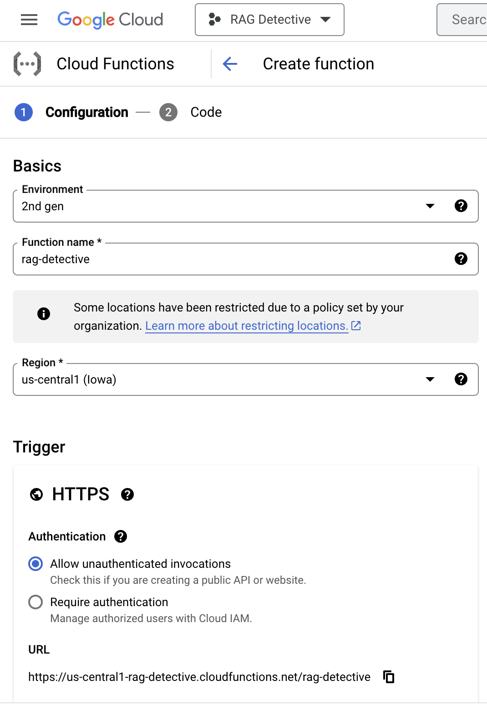
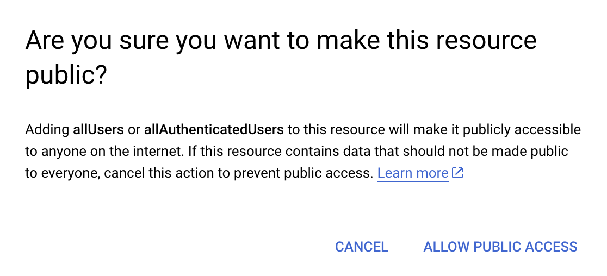
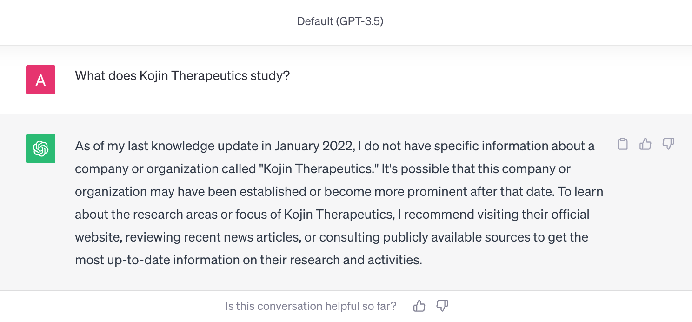

# Creating a Google Cloud Function

Google Cloud Functions are a serverless compute service that allows you to run your code without having to manage the underlying infrastructure. In this guide, we'll walk you through the steps to create a Cloud Function in Google Cloud Platform.

For our project, we have developed a customized function utilizing Retrieval Augmented Generation (RAG) to perform targeted queries within a domain-specific context. RAG integrates a language model's text generation capabilities with the ability to retrieve and incorporate external information, thereby improving question-answering by enabling the model to access a wider knowledge base for generating more precise and contextually relevant responses. The function retrieves a text file of scraped data from a companies website from our GCS bucket, stores its embeddings in a vector store using Llama Index, and subsequently queries the vector store to derive context-based responses. For an illustrative example of this function applied to our project's objectives, please refer to the end of the documentation.

## Prerequisites

Before you start, you need the following:
- A Google Cloud Platform account
- A project set up in GCP

## Step 1: Create a New Cloud Function

1. Go to the [Google Cloud Console](https://console.cloud.google.com/).
2. Select your project or create a new one.
3. In the left sidebar, navigate to **Compute** > **Cloud Functions**.

## Step 2: Create a Function

1. Click the "Create Function" button.
2. If you have not enabled the required APIs, a popup will showup. Click "ENABLE".
3. Fill in the following details:
   - **Function Name**: Choose a unique name for your function.
   - **Region**: Select the region where you want to deploy your cloud function. The region determines the physical location of the data center where your function will run. Choose the region that is geographically closest to your intended users to reduce latency.
   - **Authentication**: 
      - **Allow Unauthenticated Invocations (recommended for testing)**: Enabling this option allows anyone to call your function without requiring authentication. It's useful during development and testing phases to simplify access for testing purposes. However, it's not recommended for production functions that require strict access control.
      - **Require Authentication (recommended for production)**: Enabling this option ensures that only authenticated users or services with the appropriate permissions can invoke your function. To achieve this, you will configure authentication and access control using Identity and Access Management (IAM) roles and permissions within Google Cloud. This is the recommended approach for production functions, as it offers a high level of security and control.

      

      We decided to allow unauthenticated ivocations for our function.

   - **Trigger**: Choose a trigger for your function. (Notably, we've deliberately excluded the integration of a trigger in the current function implementation. Nevertheless, we remain open to the possibility of implementing a trigger for seamless data incorporation into a vector store whenever freshly scraped data is deposited in our GCS bucket.)
   - **Runtime, Build, Connections, and Security Settings**
      - **Memory Allocation**: Choose the memory allocation for your function, specifying how much memory it should use.
      - **Timeout**: Define the maximum execution time, often referred to as the timeout, for your function. This determines how long your function can run before it's forcibly terminated.

   

    We decided to increase both our memory allocation and timeout for the specific needs of our cloud function.

   - **Runtime environment variables**: Be sure to include your OpenAI API key as an environment variable for your function. This step is essential to ensure that your function can authenticate and communicate with the OpenAI service seamlessly. To add an environment variable, follow these steps:

      - Click "ADD VARIABLE".
      - Create a new environment variable named OPENAI_API_KEY.
      - Set its value to your OpenAI API key.
      - Save your changes.

   

   By adding the OpenAI API key as an environment variable, your function will have the necessary authentication credentials to interact with OpenAI's services securely. This is a critical step for the proper functioning of your cloud function.

4. Click "NEXT".

## Step 3: Configure and Deploy Your Function

1. Under "Runtime" select "Python 3.10".
2. Replace the code in `main.py` with the following:

```
import os
from google.cloud import storage
from llama_index import download_loader, VectorStoreIndex, SimpleDirectoryReader, Document

os.environ.get('OPENAI_API_KEY')

def query_vector_store(request):

    request_json = request.get_json(silent=True)
    request_args = request.args

    bucket_name = 'ac215_scraper_bucket'
    object_name = 'data/verily.com_2023-10-06T19-26-47.csv'
    query = 'What is Verily?'

    if request_args and 'bucket_name' in request_args:
        bucket_name = request_args['bucket_name']
    if request_args and 'object_name' in request_args:
        object_name = request_args['object_name']
    if request_args and 'query' in request_args:
        query = request_args['query']

    storage_client = storage.Client()
    bucket = storage_client.get_bucket(bucket_name)
    blob = bucket.blob(object_name)
    data = blob.download_as_text()
    documents = [Document(text=data)]
    index = VectorStoreIndex.from_documents(documents)
    query_engine = index.as_query_engine()
    response = query_engine.query(query)

    print(response)
    return f"Response: {response}"
```
3. Replace the contents of `requirements.txt` with the following:

```
functions-framework==3.*
google-cloud-storage==2.12.0
llama_index==0.8.46
```
4. Set "Entry point" to the name of your function `query_vector_store`.
5. Click "DEPLOY". Wait for the deployment to complete. Google Cloud will provide you with a URL endpoint for HTTP-triggered functions.


## Step 4: Test Your Function

Use the provided URL endpoint to test your function: https://us-central1-rag-detective.cloudfunctions.net/rag-detective.

When you test the function for the first time you'll get the following error:


Go back to the Google Cloud Function console and select the tab "Permissions". The warning states that you must assign the Invoker role (roles/run.invoker) through Cloud Run for 2nd gen functions.


Go to the Cloud Run console, and select the checkbox next to the function `rag-detective`. A window will appear to the right of the screen that will allow you to add permissions.


Select "ADD PRINCIPAL". For the "New principals" add the name `allUsers`. Assign the Role "Cloud Run Invoker" using the drop-down menu. Then click "SAVE".


A pop-up window will appear, click "ALLOW PUBLIC ACCESS".



Now when you view the function again under Google Cloud Run, it says "Allow Unauthenticated".


Now when you test the url endpoint again, you get the following output:


You can test out additional queries on the same scraped data file by adding a new `query` to the end of the url endpoint.

example: `https://us-central1-rag-detective.cloudfunctions.net/rag-detective?query=When%20was%20Verily%20founded?`

You can also test out a query on other scraped data files in the GCS bucket by adding both a new `object_name` and `query` to the end of the url endpoint.

example: `https://us-central1-rag-detective.cloudfunctions.net/rag-detective?object_name=data/assemblyai.com_2023-10-06T18-15-31.csv&query=What%20is%20Assembly%20AI?`

## Step 5: Monitor and Troubleshoot Function

You can monitor your function's performance and view logs in the Google Cloud Console. This helps you identify and fix any issues with your function.

Don't forget to delete your Cloud Function if you no longer need it to avoid incurring additional charges.

For more advanced features and customization, refer to the [Google Cloud Functions documentation](https://cloud.google.com/functions/docs).

# RAG LLM Example

The limitations of LLMs include their potential for generating incorrect or biased information and their inability to access real-time or specific external data; RAG improves queries by combining LLMs with the capacity to retrieve and incorporate external, contextually relevant information, addressing these limitations and enhancing the accuracy and relevance of responses.

For example, ChatGPT (based on the GPT-3.5 architecture developed by OpenAI) can only provide information up to its last training data in September 2021, and it cannot access or provide knowledge of events or developments that occurred after that date.

If we ask ChatGPT a question about a company that was not included in its training data we will get a response like this:



Querying information on Kojin Therapeutics, a small molecule drug discovery company within relatively specialized domain, highlights a scenario where RAG proves valuable.

In our function, we can pass in the scraped data file from Kojin's sitemap.xml and then pass in the same query: "What is Kojin Therapeutics?"

We've revised the earlier function below to provide additional context.

```
import os
from google.cloud import storage
from llama_index import download_loader, VectorStoreIndex, SimpleDirectoryReader, Document

os.environ.get('OPENAI_API_KEY')

def query_vector_store(request):

    request_json = request.get_json(silent=True)
    request_args = request.args

    bucket_name = 'ac215_scraper_bucket'
    object_name = 'data/kojintx.com_2023-10-06T22-53-54.csv'
    query = 'What is Kojin Therapeutics?'

    if request_args and 'bucket_name' in request_args:
        bucket_name = request_args['bucket_name']
    if request_args and 'object_name' in request_args:
        object_name = request_args['object_name']
    if request_args and 'query' in request_args:
        query = request_args['query']

    # Client for interacting with GCS API
    storage_client = storage.Client()
    # Performs a call to GCS API to get the bucket
    bucket = storage_client.get_bucket(bucket_name)
    # Specify the name of the object in the GCS bucket and download as text
    blob = bucket.blob(object_name)
    data = blob.download_as_text()
    # Pass the scraped text data into a document object
    document = [Document(text=data)]
    # Store document embeddings in a vector store
    index = VectorStoreIndex.from_documents(document)
    # Query the vector store for a context-relevant response
    query_engine = index.as_query_engine()
    response = query_engine.query(query)

    print(response)
    return f"Response: {response}"
```

Now the url endpoint from our cloud function will return a response to our query based on the given context.

https://us-central1-rag-detective.cloudfunctions.net/rag-detective


Additionally we can pass in other queries: for example, we could ask: "When was Kojin founded?"

https://us-central1-rag-detective.cloudfunctions.net/rag-detective?query=When%20was%20Kojin%20founded?


If we pose a question that falls outside the predefined context, for example "Who is Kim Kardashian?" would elicit a response from RAG indicating that it's beyond the provided context and cannot provide an answer. In contrast, querying the same question in ChatGPT would have generated a response because it relies on its general knowledge base to answer widely known information.

https://us-central1-rag-detective.cloudfunctions.net/rag-detective?query=Who%20is%20Kim%20Kardashian?


The above example shows that RAG proves particularly valuable when handling information outside of a LLMs training and for domain-specific inquiries, as it can tap into a broader knowledge base/domain-specific data sources, ensuring more accurate and pertinent responses.