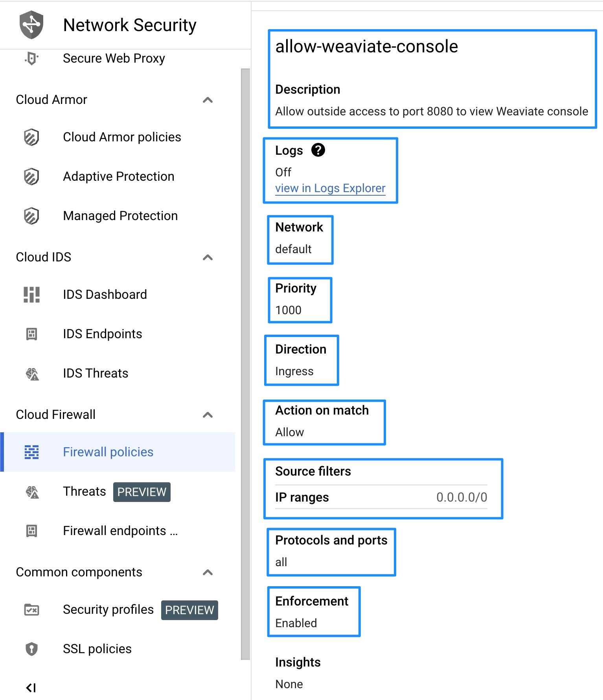

 # Instructions to get the scraper and Weaviate vector store container up and running on Google Cloud

#### These steps will take you through how we installed pipenv, Docker, Python, and Git on a virtual machine instance on Google Cloud. We then use a PAT to install the repository from GitHub, add our OpenAI API key as an environment variable, and docker compose with a custom YAML file to install Weaviate. Finally we open the Firewall to allow incoming connections to Weaviate.

### Step 1: Access the VM Instance

Open the Google Cloud Console, navigate to the "Compute Engine" section, and find your instance. Connect to your instance using SSH either via the web-based SSH client provided by Google Cloud or through your local terminal using `gcloud compute ssh`.

### Step 2: Update the Package Index

Before installing new packages, it's always good to update the package index. Run the following command:

```sh
sudo apt-get update
```

### Step 3: Install Python and pip

To install Python and pip, run the following command:

```sh
sudo apt-get install python3 python3-pip -y
```

### Step 4: Install pipenv

After installing pip, you can install pipenv as follows:

```sh
pip3 install pipenv
```

We found that pipenv installed in a location not on the environment's PATH.

It was installed in `~/.local/bin` so we added it to the `~/.bashrc` file using `nano`:

```sh
nano ~/.bashrc
```

And adding this line to the end of the `.bashrc` file:

```sh
export PATH="$PATH:~/.local/bin"
```

Then applying the changes:

```sh
source ~/.bashrc
```

### Step 5: Install Git

To install Git, run the following command:

```sh
sudo apt-get install git -y
```

### Step 6: Install Docker

To install Docker run the following script:

```sh
curl -fsSL https://get.docker.com -o get-docker.sh
sudo sh get-docker.sh
```

### Step 7: Add your user to the Docker Group (Optional)

If you want to run Docker commands as a non-root user, you need to add your user to the docker group:

```sh
sudo usermod -aG docker $USER
```
Also install the current Docker Compose

```sh
curl -SL https://github.com/docker/compose/releases/download/v2.20.3/docker-compose-linux-x86_64 -o /usr/local/bin/docker-compose
```
You may need to give it execute permissions

```sh
sudo chmod +x /usr/local/bin/docker-compose
```

After running this command, you will need to log out and log back in, or you can restart the VM instance for the changes to take effect.

### Step 8: Verify Installation

Once everything is installed, you should verify the installations:

- For Python:

```sh
python3 --version
```

- For pip:

```sh
pip3 --version
```

- For pipenv:

```sh
pipenv --version
```

- For Git:

```sh
git --version
```

- For Docker:

```sh
docker --version
```

This should show that pipenv, Docker, Python, and Git are installed on the Google Cloud VM instance.

### Step 9: Get a PAT from GitHub and clone the RAG Detective repository

Since the repository is private, to clone it you need to authenticate with GitHub. GitHub discontinued password access in 2021, so you need to create a "fine-grained access token". 

This is done using this [guide on GitHub docs.](https://docs.github.com/en/authentication/keeping-your-account-and-data-secure/managing-your-personal-access-tokens#creating-a-fine-grained-personal-access-token)

Once you have created a token, save it somewhere safe and private, as it will not display again. Using the fictional token `abcdefghijklmnopqrstuvwxyz123456789`, this is how you would then clone the repo:

```sh
git clone -b milestone2 https://abcdefghijklmnopqrstuvwxyz123456789@github.com/healthy-chicken-saladeers/rag-detective.git
```

This will create the `rag-detective` folder.

### Step 10: Add OpenAI key as environment variable

This is to allow Weaviate to access the GPT models without sharing the secrets publicly

```sh
export OPENAI_APIKEY=my-key-here
```

### Step 11: Spin up the `docker-compose.yml`

Change to the `rag-detective` directory in the repository where the `docker-compose.yml` file resides

```sh
cd ~/rag-detective
```

Spin up the docker container containing Weaviate and the scraper in "detached" mode to run in the background.

```sh
docker-compose up -d
```

### Step 12: Add a Firewall rule to GCP to allow http access to confirm Weaviate is running

This is done under the `Network  Security` tab under `Cloud Firewall` / `Firewall policies`. This is necessary to allow http access from the outside, where you can call the external IP address to ensure the Weaviate instance is running and giving a response.

Obviously this is a temporary measure just as we build the application, and we will not be providing `HTTP` access in future (even if we did want web access, it would be `HTTPS`).



For example, at one point our instance's external URL was `34.31.93.155`, so accessing port `8080` for Weaviate at `https://34.31.93.155:8080/` gave the response:

```json
{
  "links": [
    {
      "href": "/v1/meta",
      "name": "Meta information about this instance/cluster"
    },
    {
      "documentationHref": "https://weaviate.io/developers/weaviate/api/rest/schema",
      "href": "/v1/schema",
      "name": "view complete schema"
    },
    {
      "documentationHref": "https://weaviate.io/developers/weaviate/api/rest/schema",
      "href": "/v1/schema{/:className}",
      "name": "CRUD schema"
    },
    {
      "documentationHref": "https://weaviate.io/developers/weaviate/api/rest/objects",
      "href": "/v1/objects{/:id}",
      "name": "CRUD objects"
    },
    {
      "documentationHref": "https://weaviate.io/developers/weaviate/api/rest/classification,https://weaviate.io/developers/weaviate/api/rest/classification#knn-classification",
      "href": "/v1/classifications{/:id}",
      "name": "trigger and view status of classifications"
    },
    {
      "documentationHref": "https://weaviate.io/developers/weaviate/api/rest/well-known#liveness",
      "href": "/v1/.well-known/live",
      "name": "check if Weaviate is live (returns 200 on GET when live)"
    },
    {
      "documentationHref": "https://weaviate.io/developers/weaviate/api/rest/well-known#readiness",
      "href": "/v1/.well-known/ready",
      "name": "check if Weaviate is ready (returns 200 on GET when ready)"
    },
    {
      "documentationHref": "https://weaviate.io/developers/weaviate/api/rest/well-known#openid-configuration",
      "href": "/v1/.well-known/openid-configuration",
      "name": "view link to openid configuration (returns 404 on GET if no openid is configured)"
    }
  ]
}
```

### Step 13: Try out the Weaviate Console

Go to this link [https://console.weaviate.cloud/](https://console.weaviate.cloud/) to view the console login.

You'll see the following:


Enter the URL from Step 12 (http://34.31.93.155:8080) and hit `Connect`. You'll see the console, which you can then begin to work with to set up Weaviate with your schema.


