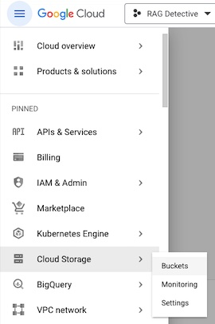
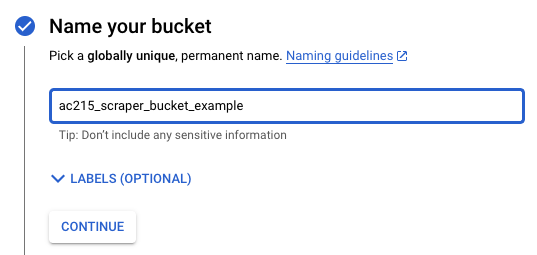
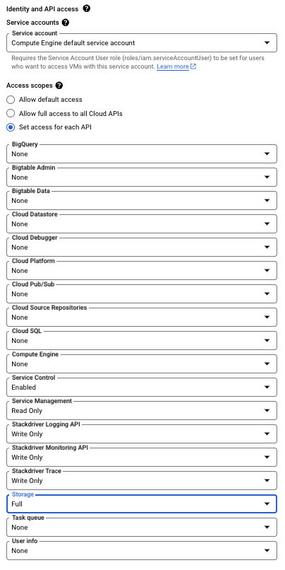

# Creating a Google Cloud Storage Bucket on GCP

Google Cloud Storage is a scalable object storage service that allows you to store and retrieve data on Google Cloud Platform. Below are the steps to create a new bucket using the GCP Console.

1. **Select Your Project:**
   - In the upper left corner of the Cloud Console, ensure that your project is selected. 

2. **Create a Bucket:**
   - In the left sidebar, go to "Cloud Storage" > "Buckets"
   - Navigate to the [Cloud Storage](https://console.cloud.google.com/storage) section.
   
   

   - Click the "Create Bucket" button.

3. **Configure Your Bucket:**
   - Fill in the required information:
  
  
     - **Name your bucket**: Enter a unique name for your bucket. Bucket names must be globally unique across all GCP projects.
     
     
     - **Choose where to store your data**: Choose your preferred region. This decision can affect latency and compliance with data regulations.
     
     
     - **Choose a storage class for your data**: Select the appropriate storage class based on your data access patterns and cost considerations.
     
     
     - **Choose how to control access to objects**: Set access control permissions for the bucket. 
     
     
     - **Choose how to protect object data**: Select from several options for enhancing the security and privacy of your data. Since we use both date and time in the file names of data saved from our scraper, we choose to not implement versioning in our bucket.
     
     


4. **Create the Bucket:**
   - Click the "Create" button to create your new bucket.

5. **Access Control (Optional):**
   - You can further manage access control and permissions for the bucket within the GCP Console.

A Google Cloud Storage (GCS) bucket serves as a robust and scalable platform for data storage and management. GCS ensures data durability and redundancy, which is essential for safeguarding critical information. Moreover, it offers granular access control, enabling you to specify who can access your data, making it suitable for scenarios requiring privacy or collaboration.

For more information on using Google Cloud Storage and managing buckets, refer to the [official documentation](https://cloud.google.com/storage/docs).


# Opening Permissions on a Private GCP VM to Access a GCS Bucket

Since we are working on a private Google Cloud VM, we will need to grant it access to a Google Cloud Storage (GCS) bucket. Below are the steps needed to configure the necessary permissions and credentials. 

## Opening Permissions in GCP Console to Save Files from a Private GCP VM to a GCS Bucket

To save files from a Python script running on a private Google Cloud Platform (GCP) VM to a Google Cloud Storage (GCS) bucket, you'll need to configure the necessary permissions and access controls. 

1. **Select Your Project:**
   - In the upper-right corner of the Cloud Console, ensure you have selected the correct project associated with your VM and GCS bucket.

2. **Navigate to Your VM Instance:**
   - In the left sidebar, go to "Compute Engine" > "VM instances"

3. **Edit VM Instance Permissions:**
   - Click on the name of your private VM instance to access its details.
   
   
   
   - Click the "Stop" button to first stop your instance. You must stop the VM instance to edit its service account.
   - Wait for the instance to stop and then click the "Edit" button to modify the instance settings.

4. **Edit Identity and API access:**
   - Scroll down to the "Identity and API access" section.
   - Select the service account for your VM.
   - Under "Access scopes" select "Set access for each API".
   - The "Storage" drop-down should be set to "Full", which will grant both read and write access to your bucket.
   
   

5. **Save the VM Instance Changes:**
   - Scroll down and click the "Save" button to apply the changes to your VM instance.
   - Clicke "Start/Resume" to restart your instance.

6. **Access GCS from Your Python Script:**
   - Use the Google Cloud Storage Python client library in your Python script to save files to the GCS bucket. 

By following these steps, you have allowed your private GCP VM full access to GCS and other GCP services. This configuration enables your Python script running on the VM to save files to the specified GCS bucket.

## Installing Google Cloud Storage Client Library

To access the Google Cloud Storage Python client library in your project and use it within your Python script, follow these steps:

1. **Navigate to Your Project Directory:**
   - Open your terminal and navigate to the directory where your Python script is located or where your project files are stored.

2. **Install Google Cloud Storage Library:**
   - Run the following command to install the Google Cloud Storage library:
   
     ```shell
     pipenv install google-cloud-storage
     ```

   This command will add the library as a dependency in your `Pipfile` and install it in your virtual environment.

Now, you have the Google Cloud Storage Python client library installed and ready to use within your Python script. You can import and use the library to interact with GCS resources seamlessly.

## Optional Steps for accessing a GCS Bucket in your Private GCP VM

1. **Create a Service Account (Optional):**
   - If you haven't already, create a [service account](https://cloud.google.com/iam/docs/creating-managing-service-accounts) that your VM will use to access GCS. Assign it the necessary roles (e.g., Storage Object Viewer) to interact with the bucket.

2. **Generate and Download Service Account Key (Optional):**
   - If you created a service account, [generate a JSON key file](https://cloud.google.com/iam/docs/creating-managing-service-account-keys) for it. This file will be used for authentication.

3. **Install Google Cloud SDK (Optional):**
   - If not already installed, you can install the [Google Cloud SDK](https://cloud.google.com/sdk) on your VM. This provides `gsutil`, which is a handy command-line tool for interacting with GCS.

4. **Authorize Service Account (Optional):**
   - If you created a service account, use the key file to [authorize the service account](https://cloud.google.com/sdk/gcloud/reference/auth/activate-service-account) on your VM.

5. **Access GCS from Your VM:**
   - You can now use `gsutil` or any other GCS client library to access the GCS bucket from your VM. For example:
   
     ```shell
     gsutil ls gs://your-bucket-name/
     ```

6. **Ensure Firewall Rules (If Applicable):**
   - If your VM has a firewall, ensure that it allows outbound traffic on port 443 (HTTPS) for GCS API access.
